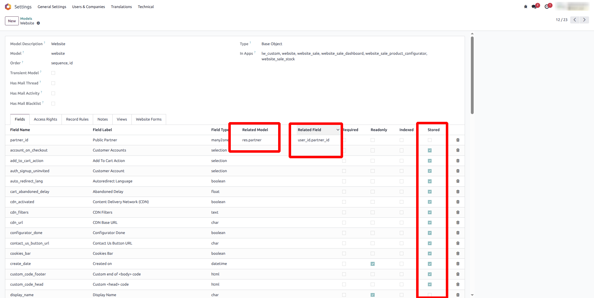
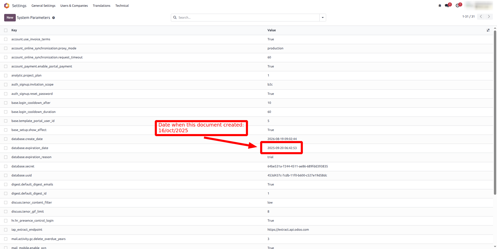
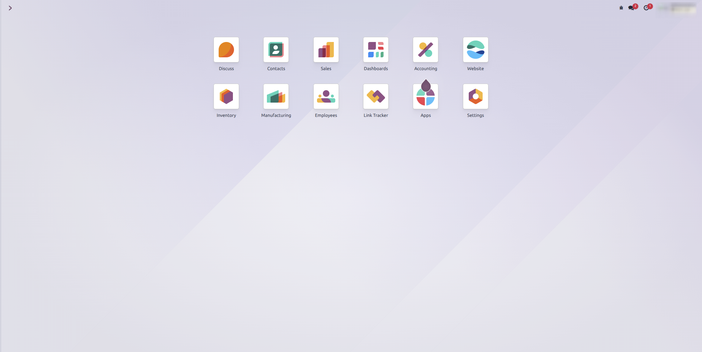

# About

This module allows you to display the related model for fields of type Many2one, One2many, and Many2many on the ir.model form view.

Version Log:
- **0.0.1** : This module make field with type Many2one, One2many, and Many2many on ir.model form view shows their related model.
- **0.0.2** : Show "related" relation and store true or not.
- **0.0.3** : Bypass enterprise subscription blockUI LMAO (does this count as crime?),

## Changes in ir.model form

## Remove blockUI enterprise
The database has been expired

Block UI for database expired gone, now you can use it normally

